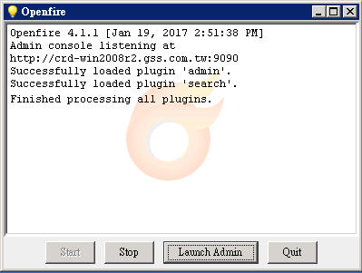

# 安裝Java + Openfire + MariaDB in Windows Server 備忘錄 Part 1

安裝環境：(VM) Windows Server，無Java, 無DB

安裝內容：Java8, Openfire 4.1.1, MariaDB 10.1.21

### 安裝 JDK 8 

進入[oracle jdk download](http://www.oracle.com/technetwork/java/javase/downloads/jdk8-downloads-2133151.html)，找到對應的作業系統以及位元(本台安裝 jdk-8u121-windows-x64.exe)

### 設定環境變數

右鍵我的電腦 -> 內容 -> 進階系統設定 -> 環境變數 -> 在系統變數中找到PATH 
-> 編輯 -> 輸入bin路徑(通常在C:\Program Files\Java\jdk1.8.0_121\bin, 請用;區隔路徑) 
->完成後請打開terminal輸入`javac`,出現指令表示成功

### 安裝 JRE

進入[oracle jre 下載頁面](http://www.oracle.com/technetwork/java/javase/downloads/jre8-downloads-2133155.html)，找到對應的作業系統以及位元(本台安裝 jre-8u121-windows-x64.exe)

### 安裝MariaDB 10

進入[MariaDB](https://downloads.mariadb.org/mariadb/10.1.21/)，找到穩定版(本台安裝 10.1.21)

請選擇副檔名為.msi的檔案(有GUI安裝介面)並參考[windows GUI install](https://mariadb.com/kb/en/mariadb/installing-mariadb-msi-packages-on-windows/)

### 安裝 Openfire

進入[openfire download](http://www.igniterealtime.org/downloads/index.jsp)，找到合適的作業系統版本(本台安裝Openfire 4.1.1)

### 設定 Openfire 資料庫

開始>>找到MariaDB 10.1資料夾中>>MySQL Client (MariaDBXXX)之terminal 

<table><tr><td bgcolor=black>
MariaDB [(none)]> CREATE DATABASE openfire CHARACTER SET utf8 COLLATE utf8_general_ci; 
Query OK, 1 row affected (0.00 sec)  
 
MariaDB [(none)]> GRANT ALL ON openfire.* TO 'openfire'@'localhost' IDENTIFIED BY '《op專用密碼》'; 
Query OK, 0 rows affected (0.00 sec) 
</td></tr></table>

這邊設定給 openfire 專用的密碼請先記下，接下來設定 openfire 時會需要填入。如果要使用其他 GUI client 如 MySQLWorkbench 連接資料庫，可順便把遠端連線的權限打開

<table><tr><td bgcolor=black>
MariaDB [(none)]> GRANT ALL PRIVILEGES ON *.* TO 'remote_user'@'%' IDENTIFIED BY '《你的密碼》' WITH GRANT OPTION; 
Query OK, 0 rows affected (0.00 sec)   
 
MariaDB [(none)]> flush privileges; 
Query OK, 0 rows affected (0.00 sec)  
 
 
MariaDB [(none)]> use openfire; 
Database changed  
 
MariaDB [openfire]> source /opt/openfire/resources/database/openfire_mysql.sql; 
Query OK, 0 rows affected (0.02 sec) 
...中略... 
Query OK, 1 row affected (0.00 sec)  
 
MariaDB [openfire]> ALTER TABLE ofOffline CHANGE COLUMN stanza stanza TEXT CHARACTER SET utf8mb4 COLLATE utf8mb4_unicode_ci NOT NULL;  
 
MariaDB [openfire]> ALTER TABLE ofMucConversationLog CHANGE COLUMN body body TEXT CHARACTER SET utf8mb4 COLLATE utf8mb4_unicode_ci NULL;  
 
MariaDB [openfire]> ALTER TABLE ofMucConversationLog CHANGE COLUMN subject subject VARCHAR(100) CHARACTER SET utf8mb4 COLLATE utf8mb4_unicode_ci NULL;  
 
MariaDB [openfire]> ALTER TABLE ofMucRoom CHANGE COLUMN naturalName naturalName VARCHAR(255) CHARACTER SET utf8mb4 COLLATE utf8mb4_unicode_ci NOT NULL;  
 
MariaDB [openfire]> ALTER TABLE ofMucRoom CHANGE COLUMN subject subject VARCHAR(100) CHARACTER SET utf8mb4 COLLATE utf8mb4_unicode_ci NULL;  
 
MariaDB [openfire]> ALTER TABLE ofPrivate CHANGE COLUMN privateData privateData TEXT CHARACTER SET utf8mb4 COLLATE utf8mb4_unicode_ci NOT NULL;  
 
MariaDB [openfire]> ALTER TABLE ofVCard CHANGE COLUMN vcard vcard MEDIUMTEXT CHARACTER SET utf8mb4 COLLATE utf8mb4_unicode_ci NOT NULL;  
 
MariaDB [openfire]> exit; 
Bye 
</td></tr></table>

編輯 openfire 的設定檔(通常會在 安裝路徑\Openfire\bin\extra\redhat\openfire-sysconfig)，加入 JAVA_HOME 路徑

		...前略...
		# If you wish to override the auto-detected JAVA_HOME variable, uncomment
		# and change the following line.
		JAVA_HOME=C:\Program Files (x86)\Openfire\bin\extra\redhat\openfire-sysconfig

### Openfire 設定精靈			////////////////////////TODO

用瀏覽器開啟 

http://<你的IP或Domain Name>:9090 

會進入 Openfire 初始設定畫面。 

Openfire Setup 這部分 UI 的 jsp 感覺 bug 頗多，過程中有可能會遇到些狀況，不同版本狀況可能不同，甚至同個版本有時也會出現無法重現的問題。下面也會就曾經遇到的狀況和可以嘗試的解法做簡單的說明。

選擇語系，請先選 English，公司有為 Openfire 加上繁體中文，等安裝完畢後可再另行設定。
Server Settings: Domain 這欄位預設會抓到機器名，但如果是放在內部網路的測試機，無法DNS反查到，請填入 IP。Property Encryption Key 隨便打即可。

Database Settings: 我們要使用 MariaDB，不用改預設值，直接 Continue 進入下一頁開始設定 DB。Database URL 這欄我們要加入 UTF8 相關的參數，否則中文訊息存入DB時會變成亂碼。此欄請填：

	jdbc:mysql://localhost:3306/openfire?useUnicode=true&characterEncoding=UTF-8&characterSetResults=UTF-8&rewriteBatchedStatements=true 

如果你是照著上篇 Part1 的說明安裝，Username 就是 openfire，Password 是請你記下來備用的 <td bgcolor=black>《op專用密碼》</td>。其他項目目前不用更改，以後有需求再從管理介面調整。

附註：3.10.2 的 bug 造成上面填的 jdbc 被寫入 openfire.xml 時有多餘的字元，本文最後我們會需要自己修改 openfire.xml，否則依然會遇到亂碼問題。

screenshot2 /////////////////TODO

Profile Settings: 這邊請選第一個後設定登入帳號以及密碼，此為當入openfire的帳號密碼

